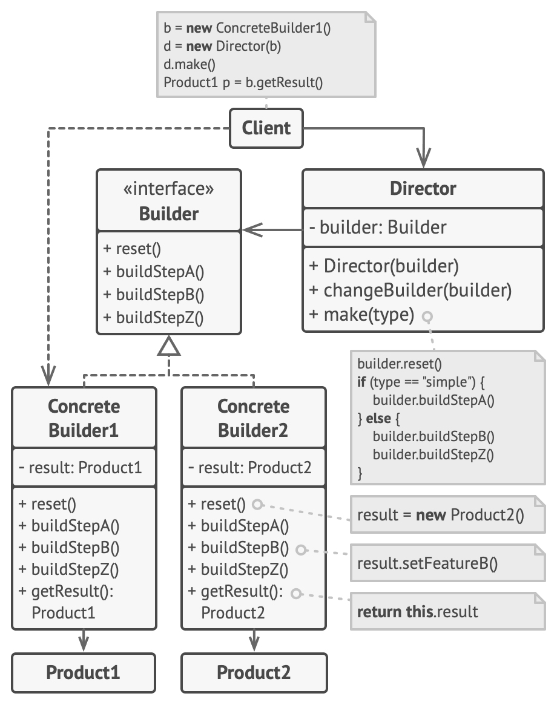

## 基本描述
- Builder Pattern
- 生成器模式
- 建造者模式可以将一个产品的内部表象与产品的生成过程分割开来，从而可以使一个建造过程生成具有不同的内部表象的产品对象。
- 将一个复杂对象的构建与它的表示分离，使得同样的构建过程可以创建不同的表示。
## 结构


## 真实世界列子
- 第一次进入游戏，生成角色。眉毛，眼睛，衣服，发型等等。最后生成了一个独一无二的角色。
## 举例
### gorm
gorm 的链式结构就是 builder 模式的实践
```go
err := db.WithContext(ctx).Debug().Table("abc").Where("a = ?", 3).Find(&ret).Error
stmt := db.WithContext(ctx).Debug().Table("abc").Updates(&dao)
n, err := stmt.RowAffected, stmt.Error
```

### http.Request
在 Go 开源项目中，经常会看到使用 builder 模式的例子。其中一个非常流行的例子是标准库中的 http.Request 结构体。

http.Request 结构体用于表示 HTTP 请求，并包含了请求的各种信息，例如 URL、HTTP 方法和头部。在创建 http.Request 实例时可以使用 builder 模式，通过链式调用一系列方法来设置请求的各个属性。

例如，下面的代码演示了如何使用 builder 模式创建一个 GET 请求：
```go
req, err := http.NewRequest("GET", "https://example.com", nil)
if err != nil {
    // 处理错误
}

// 设置请求头部
req.Header.Add("Accept-Encoding", "gzip, deflate")

// 发送请求并处理响应
client := http.Client{}
resp, err := client.Do(req)
if err != nil {
    // 处理错误
}
defer resp.Body.Close()

// 解析响应内容
body, err := ioutil.ReadAll(resp.Body)
if err != nil {
    // 处理错误
}

fmt.Println(string(body))
```
在上面的代码中，我们首先使用 http.NewRequest 函数创建了一个 GET 请求的实例，并通过调用 Header.Add 方法设置了请求头部。然后，我们使用 http.Client 发送了这个请求，并通过 ioutil.ReadAll 函数读取了响应体中的内容。

可以看到，在创建 http.Request 实例时，我们使用了 builder 模式，通过调用一系列方法来设置请求的各个属性。这种方式可以让代码更加清晰易懂，并且避免了传统的构造函数需要大量参数的问题。