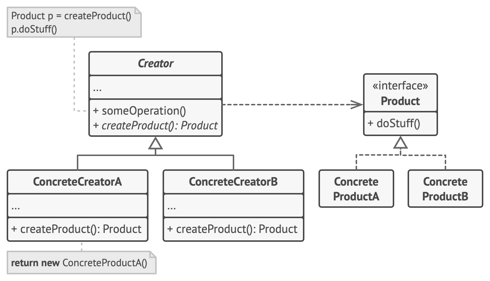

## 基本描述
- 工厂方法模式（Factory Method）
- 定义一个用于创建对象的接口，让子类决定实例化哪一个类。工厂方法使一个类的实例化延迟到其子类
- Define an interface for creating a single object, but let subclasses decide which class to instantiate. Factory Method lets a class defer instantiation to subclasses.
## 结构

## 真实世界列子
- 物流运输，不关心用什么交通工具，所有交通工具只有一个特点，就是可以用来运输。 
- 隐藏了具体的运输工具
## 优势 & 劣势
- 工厂方法克服了简单工厂违背开放-封闭原则的缺点，又保持了封装对象创建过程的优点
- 缺点是由于每加一个产品，就需要加一个产品工厂的类，增加了额外的开发量
## 关系