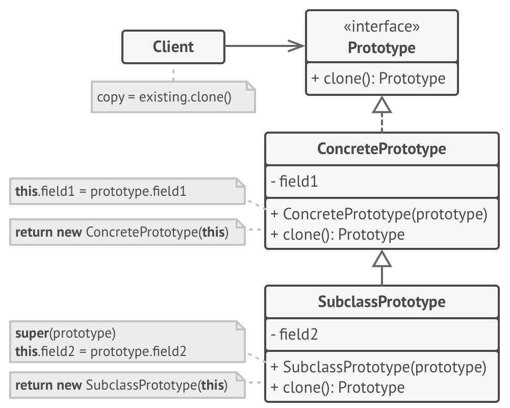

## 基本描述
- 原型模式，即Prototype，是指创建新对象的时候，根据现有的一个原型来创建。
- 原型模式其实就是从一个对象再创建另外一个可定制的对象，而且不需知道任何创建的细节
## 结构


## 真实世界列子
- 细胞的有丝分裂
## 优势 & 劣势
- 一般在初始化的信息不发生变化的情况下，克隆是最好的办法。这既隐藏了对象创建的细节，又对性能是大大的提高
- 比如数据库连接，上下文状态
- 浅拷贝和深拷贝
  - Clone() 结构拷贝，浅拷贝
  - Copy() 复制数据拷贝，深拷贝
## 举例
### gin.Context
若是要在gin的goroutine中使用context
由于主协程中的Context被回收，在goroutinue中需要Copy一份Context。
```go
// github.com/gin-gonic/gin/context.go line 78
...
// Copy returns a copy of the current context that can be safely used outside the request's scope.
// This has to be used when the context has to be passed to a goroutine.
func (c *Context) Copy() *Context {
	var cp = *c
	cp.writermem.ResponseWriter = nil
	cp.Writer = &cp.writermem
	cp.index = abortIndex
	cp.handlers = nil
	return &cp
}

```

### mgo session
mgo 链接数据库时，可以直接拷贝一份新的会话。
```go
// gopkg.in/mgo.v2/session.go
...
// Copy works just like New, but preserves the exact authentication
// information from the original session.
func (s *Session) Copy() *Session {
s.m.Lock()
scopy := copySession(s, true)
s.m.Unlock()
scopy.Refresh()
return scopy
}
```


